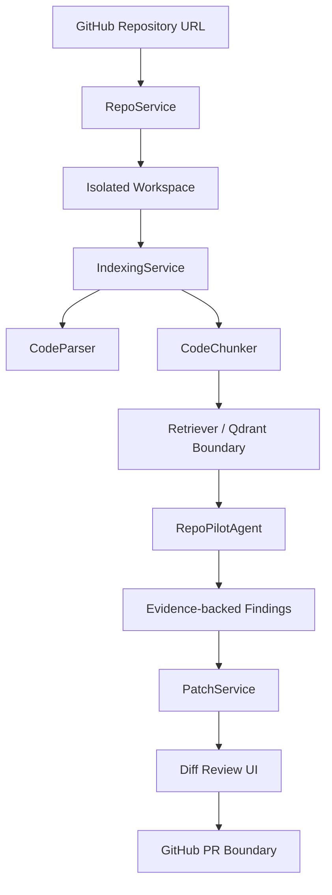

# RepoPilot

> Free-first local AI software engineering agent for repo analysis, evidence-backed review, and patch drafts.

RepoPilot is a portfolio-grade AI software engineering agent prototype. Its default path does not require paid APIs. It imports a repository, indexes code, retrieves local evidence, runs deterministic static rules, shows file/line-grounded findings, and generates scoped patch drafts behind a human approval step.


## Why This Project Exists

Modern engineering teams increasingly care about developers who can use AI to improve software delivery, not just call an LLM API. RepoPilot demonstrates that direction with:

- repository ingestion and indexing
- static code understanding
- retrieval before generation
- multi-step agent workflow
- evidence-backed analysis
- patch review and scope validation
- cost-aware cloud LLM architecture
- optional local/fake provider for no-cost development

## Current MVP

This repository currently contains a working vertical slice:

- FastAPI backend with repo import, indexing, analysis, chat, patch, and mock PR routes
- Next.js dashboard for import, analysis, agent timeline, findings, and diff review
- Python and JS/TS static parsing scaffold
- in-memory retrieval layer shaped like the future Qdrant integration
- fake LLM provider so the app and tests run without paid API calls
- patch validation that rejects files outside the approved scope
- architecture, agent flow, cost control, prompt strategy, and failure-case docs

Production-quality intelligence is intentionally isolated behind provider/retrieval boundaries so OpenAI, Claude, Qdrant, and tree-sitter can be added without rewriting the whole app.

## Demo Flow

```txt
GitHub repo URL
  -> safe public repo import
  -> code indexing
  -> syntax-aware metadata extraction
  -> retrieval with file/line evidence
  -> agent timeline
  -> grounded findings
  -> scoped patch draft
  -> PR workflow boundary
```

## Architecture



## Agent Workflow

```txt
Planner
  -> RepoReader
  -> CodeSearcher
  -> ArchitectureAnalyzer
  -> BugDetector
  -> TestWriter
  -> PatchWriter
  -> Reviewer
```

Core rule:

> RepoPilot should not claim a file-level issue unless it can cite retrieved file and line evidence.

## Tech Stack

| Area | Stack |
| --- | --- |
| Backend | FastAPI, Pydantic |
| Frontend | Next.js, React, TypeScript |
| Agent Boundary | LangGraph-style stateful node graph |
| Retrieval | In-memory MVP, Qdrant-ready boundary |
| Code Analysis | Python AST, JS/TS regex scaffold, tree-sitter planned |
| LLM | Fake provider now, OpenAI/Claude adapters planned |
| DevOps | Docker Compose |
| Testing | pytest, Next.js build validation |

## Cost Strategy

RepoPilot is cloud-LLM-primary because high-quality software engineering agents need strong reasoning models. At the same time, it avoids unnecessary API spend through:

- fake provider for local development and tests
- retrieval before generation
- shallow analysis by default
- explicit deep-analysis toggle
- hard indexing limits
- patch generation as a separate action
- PR creation blocked without confirmation

Ollama/local models can be added as a quality-limited fallback, but they are not the recommended primary path for impressive code-analysis performance.

## Run Locally

Backend:

```bash
cd apps/api
python -m pip install -e .[dev]
uvicorn app.main:app --reload
```

Frontend:

```bash
cd apps/web
npm install
npm run dev
```

Open:

```txt
http://localhost:3000
```

Docker:

```bash
docker compose up
```

## Free Deployment

RepoPilot is configured for free deployment as a Hugging Face Spaces Docker Space.

Recommended free deployment shape:

```txt
Hugging Face Spaces CPU Basic
  -> Dockerfile
  -> Next.js static export
  -> FastAPI static file serving
  -> local static-analysis agent
```

Steps:

1. Create a new Hugging Face Space.
2. Select `Docker` as the SDK.
3. Push this project into the Space repository.
4. Use this repository's `SPACE_README.md` as the Space `README.md`.
5. After the build finishes, the Space URL opens the RepoPilot UI.

The free deployment keeps these defaults:

- no paid LLM API
- no cloud vector database
- local static-rule analysis
- temporary workspace storage
- public GitHub repositories only
- repo/file size limits
- mock PR workflow

You can also test the deployment image locally:

```bash
docker build -t repopilot .
docker run --rm -p 7860:7860 repopilot
```

Open:

```txt
http://localhost:7860
```

## Test and Verify

Backend tests:

```bash
cd apps/api
python -m pytest tests
```

Frontend build:

```bash
cd apps/web
npm install
npm run build
```

Verified in this MVP:

- `12 passed` backend tests
- Python compile check passed
- Next.js production build passed
- API health endpoint returned `ok`
- web dev server returned HTTP `200`

## Environment

Default no-cost local mode:

```txt
REPOPILOT_LLM_PROVIDER=fake
```

Future high-quality mode:

```txt
REPOPILOT_LLM_PROVIDER=openai
REPOPILOT_OPENAI_API_KEY=...
```

or:

```txt
REPOPILOT_LLM_PROVIDER=anthropic
REPOPILOT_ANTHROPIC_API_KEY=...
```

## Roadmap

- [ ] Replace the fake provider with real OpenAI/Claude adapters
- [ ] Add Qdrant persistence for vector retrieval
- [ ] Replace JS/TS regex parsing with tree-sitter
- [ ] Add commit-SHA and file-hash caching
- [ ] Improve bug-scan prompts with structured output
- [ ] Generate tests from selected findings
- [ ] Apply patches in an isolated branch
- [ ] Create real GitHub pull requests
- [ ] Add demo GIF and benchmark cases
- [ ] Add a public Hugging Face Spaces demo link

## Limitations

RepoPilot is intentionally scoped. It is optimized for codebase understanding, evidence-backed review, test suggestions, and small patch drafts. It is not intended to fully autonomously rewrite large production systems.

See [docs/failure-cases.md](docs/failure-cases.md) for explicit failure modes.
