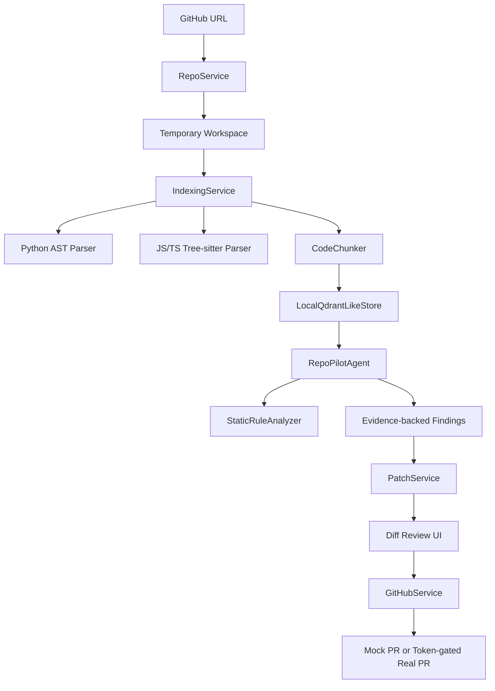

# RepoPilot

> Free-first GitHub repository analysis agent that turns a public repo into evidence-backed findings and patch drafts.

[한국어 README](README.md) · Live Demo: [https://jeonghwanju-repopilot.hf.space](https://jeonghwanju-repopilot.hf.space/) · Code Guide: [https://coding-jhj.github.io/RepoPilot/](https://coding-jhj.github.io/RepoPilot/)

RepoPilot imports a public GitHub repository, indexes source files, runs deterministic local analysis, and shows findings with file/line evidence. It is designed as a portfolio-grade MVP for repo-aware AI engineering workflows without OpenAI, Claude, paid inference APIs, hosted databases, or paid vector databases.


## Why It Exists

Most coding-agent demos hide the hard parts behind paid LLM calls and opaque infrastructure. RepoPilot focuses on the repo workflow itself:

1. import a public repository,
2. index real files under strict limits,
3. retrieve relevant code chunks,
4. run agent-like analysis steps,
5. require file/line evidence before making claims,
6. draft patches only for approved paths,
7. optionally open a real GitHub PR when the user supplies a token.

## What Works Today

- public GitHub repository import
- temporary workspace creation and clone timeout handling
- Python, JavaScript, TypeScript, TSX, and Markdown indexing
- Python AST symbol/import extraction
- JS/TS/TSX tree-sitter parsing with regex fallback
- local chunk retrieval through an in-memory Qdrant-like boundary
- sequential agent workflow timeline
- evidence-backed findings with path and line range
- deterministic static rules
  - hardcoded secret candidates
  - bare `except:`
  - `eval()` usage
- patch draft generation from approved evidence paths
- patch scope validation before review
- optional real GitHub Pull Request creation when a token and explicit confirmation are supplied
- mocked PR response for the public demo when no token is supplied
- FastAPI serving the static Next.js export
- Hugging Face Spaces CPU Basic deployment

## What It Does Not Claim

- It is not a Devin clone.
- It does not perform deep paid-LLM bug reasoning by default.
- It is not optimized for very large repositories.
- It does not store per-user history or persistent workspaces.
- Patch drafts still require human review.

## Workflow

```txt
GitHub URL
  -> safe repo clone
  -> file walk under size limits
  -> parser + chunker
  -> local retrieval
  -> agent workflow
  -> evidence-backed findings
  -> scoped patch draft
  -> optional confirmed PR creation
```

## Architecture



## Agent Flow

```txt
Planner
  -> RepoReader
  -> CodeSearcher
  -> ArchitectureAnalyzer
  -> BugDetector
  -> TestWriter
  -> PatchWriter
  -> Reviewer
```

Quality rule:

> RepoPilot should not report a file-level issue unless it can show retrieved file/line evidence.

## Tech Stack

| Area | Stack |
| --- | --- |
| Backend | FastAPI, Pydantic |
| Frontend | Next.js static export, React, TypeScript |
| Deployment | Hugging Face Spaces Docker |
| Code Analysis | Python AST, JS/TS/TSX tree-sitter, regex fallback |
| Retrieval | In-memory chunk search behind a Qdrant-like boundary |
| Static Rules | hardcoded secret, bare except, eval detection |
| GitHub | Token-gated branch, commit, and PR flow via REST |
| LLM | Not required by default |
| Tests | pytest, Next.js build |

## Local Run

Backend:

```bash
cd apps/api
python -m pip install -e .[dev]
uvicorn app.main:app --reload
```

Frontend:

```bash
cd apps/web
npm install
npm run dev
```

Docker:

```bash
docker build -t repopilot .
docker run --rm -p 7860:7860 repopilot
```

## Environment Limits

The free Space deployment is intentionally bounded:

```txt
REPOPILOT_MAX_FILES_INDEXED=120
REPOPILOT_MAX_FILE_BYTES=120000
REPOPILOT_CLONE_TIMEOUT_SECONDS=45
```

## Verification

Backend:

```bash
cd apps/api
python -m pytest tests
```

Frontend:

```bash
cd apps/web
npm install
npm run build
```

Current verification target:

- backend test suite
- tree-sitter JS/TS parsing regression tests
- GitHub PR service mock-transport tests
- Next.js static export build
- Hugging Face Space `/health` response

## Main Files

```txt
apps/api/app/main.py                       FastAPI app + static frontend serving
apps/api/app/services/repo_service.py      GitHub URL validation, clone, workspace path
apps/api/app/services/indexing_service.py  file walking, parsing, chunk indexing
apps/api/app/code/parser.py                Python AST + JS/TS parser dispatch
apps/api/app/code/treesitter_parser.py     tree-sitter JS/TS/TSX symbols/imports
apps/api/app/code/rules.py                 deterministic static-analysis rules
apps/api/app/agents/graph.py               agent node workflow runner
apps/api/app/services/patch_service.py     patch draft + scope validation
apps/api/app/services/github_service.py    mock vs real PR entry point
apps/api/app/services/github_pr_service.py GitHub REST branch/commit/PR flow
apps/web/app/page.tsx                      main demo UI
Dockerfile                                 Hugging Face Spaces deployment image
```

## Roadmap

- [ ] expand deterministic rule coverage
- [ ] add dependency-graph risk checks
- [ ] improve patch templates
- [ ] add benchmark demo repositories
- [ ] add unified-diff application flow
- [ ] connect the frontend PR token flow with clearer safety UX

## Limitations

RepoPilot is optimized for small public repositories on free infrastructure. CPU, disk, network, and runtime limits are expected. Findings are deterministic static-rule and retrieval results unless a future LLM provider is explicitly enabled.
