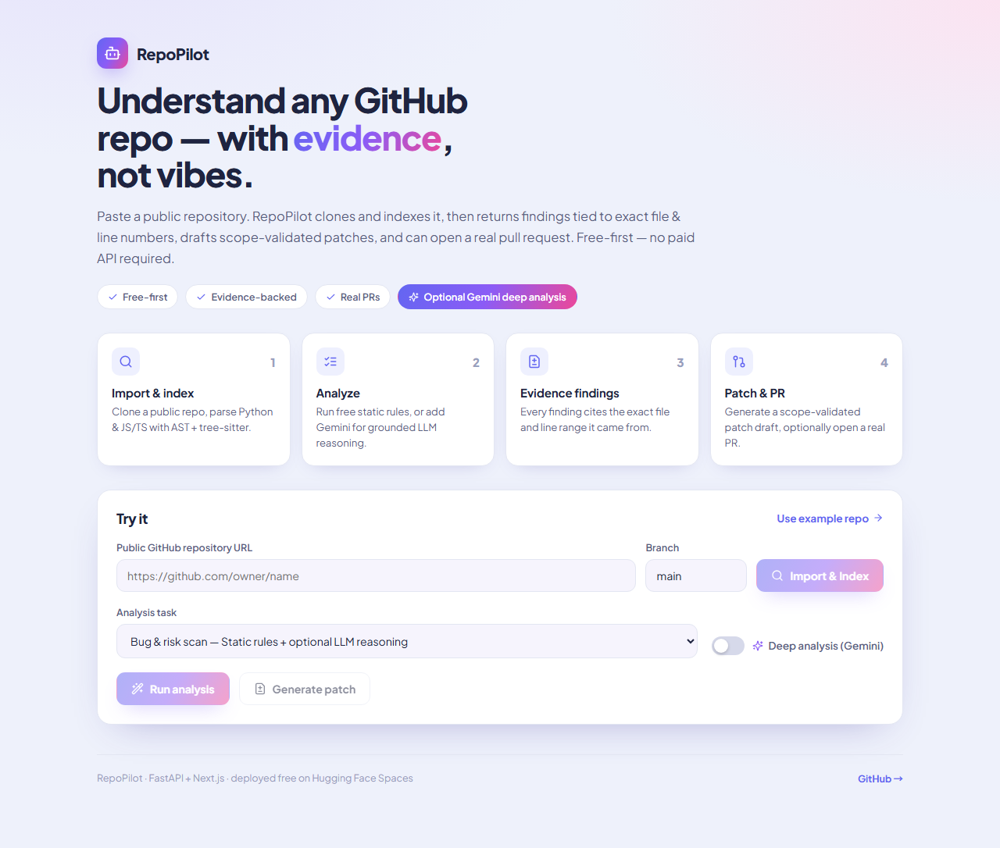
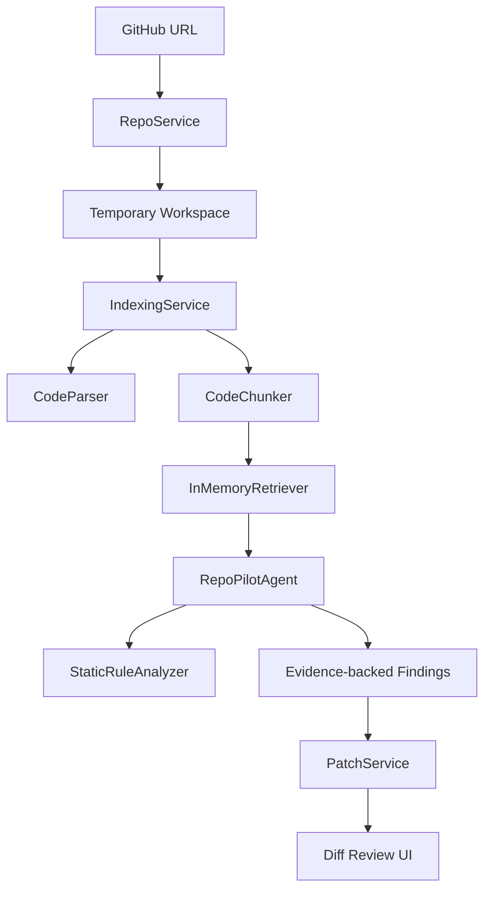

# RepoPilot

> **public GitHub 저장소를 붙여넣으면 → 파일·라인 근거가 달린 분석 결과 → scope 검증된 patch 초안 → 실제 PR 까지.** 유료 API 없이 동작하는 무료 코드 분석 Agent.

[English README](README.en.md) · **Live Demo: [jeonghwanju-repopilot.hf.space](https://jeonghwanju-repopilot.hf.space/)** · [코드 해설서](https://coding-jhj.github.io/RepoPilot/repopilot-code-guide.html)




RepoPilot은 OpenAI·Claude·유료 DB·유료 vector DB 없이 동작합니다. 기본은 결정론적 정적 분석(무료)이고,
**deep analysis**를 켜고 무료 Gemini 키를 넣으면 같은 evidence 위에서 LLM 추론까지 더해집니다.
모든 finding은 반드시 가져온 코드의 파일·라인 근거를 함께 보여줍니다.

## 현재 되는 것

- public GitHub 저장소 URL 입력
- 저장소 clone 및 임시 workspace 생성
- Python, JavaScript, TypeScript, Markdown 파일 인덱싱
- Python AST 기반 class/function/import 추출
- JS/TS/TSX tree-sitter 기반 정밀 파싱 (class, method, interface, type, enum, arrow-function, import)
- local retrieval 기반 관련 코드 chunk 검색 (기본 키워드, opt-in MiniLM 임베딩 의미 검색 `REPOPILOT_USE_EMBEDDINGS=true`)
- agent timeline 표시
- 파일/라인 근거가 포함된 finding 표시
- 무료 정적 분석 rule 실행
  - hardcoded secret 후보
  - bare `except:`
  - `eval()` 사용
- **deep analysis (선택)**: 무료 Gemini 키를 넣으면 retrieved evidence 위에서 LLM 추론으로 추가 finding + 요약 생성 (기본값 `gemini-3.5-flash`, 키 없으면 정적 분석만)
- 선택한 evidence path 기준 patch draft 생성
- patch가 승인된 파일 범위 안에 있는지 검증
- 실제 GitHub Pull Request 생성 (opt-in: 토큰 제공 시 브랜치 생성 → 파일 커밋 → PR 오픈, 토큰 없으면 mock)
- FastAPI가 Next.js static export를 함께 서빙
- Hugging Face Spaces CPU Basic 무료 배포
- **eval 하네스 2종** (evals over vibes): retrieval(recall@k/MRR) · bug-finding(precision/recall/F1) — 결정적 베이스라인을 숫자로 고정

## 아직 안 되는 것

- 서버 측 기본 LLM (deep analysis는 사용자가 무료 Gemini 키를 직접 제공해야 작동)
- unified diff 자동 적용 (실제 PR은 명시적 파일 내용을 받음)
- 대형 repo 전체 분석
- 영구 저장소 또는 사용자별 history 저장

이 프로젝트는 “완성형 Devin 클론”이 아니라, **돈 안 드는 무료 환경에서 실무형 Agent 구조를 어디까지 만들 수 있는지 보여주는 MVP**입니다.

## 사용 흐름

```txt
GitHub URL 입력
  -> repo clone
  -> 파일 인덱싱
  -> 코드 chunk 검색
  -> agent workflow 실행
  -> evidence 기반 finding 표시
  -> patch draft 생성
  -> scope validation
```

## 아키텍처



## Agent Workflow

```txt
Planner
  -> RepoReader
  -> CodeSearcher
  -> ArchitectureAnalyzer
  -> BugDetector
  -> TestWriter
  -> PatchWriter
  -> Reviewer
```

핵심 원칙:

> 파일 단위 문제를 말할 때는 반드시 retrieved code evidence를 함께 보여준다.

## 기술 스택

| 영역 | 기술 |
| --- | --- |
| Backend | FastAPI, Pydantic |
| Frontend | Next.js static export, React, TypeScript |
| Deployment | Hugging Face Spaces Docker |
| Code Analysis | Python AST, JS/TS/TSX tree-sitter (regex fallback) |
| Retrieval | In-memory chunk search (키워드 + opt-in MiniLM 임베딩 의미 검색) |
| Static Rules | hardcoded secret, bare except, eval 탐지 |
| GitHub | 실제 PR 생성 (opt-in 토큰, httpx REST) |
| LLM | 기본 사용 안 함 (deep analysis는 BYO Gemini 키) |
| Eval | retrieval(recall@k/MRR) · bug-finding(precision/recall/F1) 하네스 |
| Tests | pytest, Next.js build |

## 무료 배포 구조

```txt
Hugging Face Spaces CPU Basic
  -> Dockerfile
  -> Next.js static export
  -> FastAPI static file serving
  -> local static-analysis agent
```

무료로 유지하기 위해 다음을 사용하지 않습니다.

- OpenAI API
- Claude API
- paid inference API
- Qdrant Cloud
- hosted database
- GPU instance

Space 환경에서는 repo/file 크기와 clone timeout을 제한합니다.

```txt
REPOPILOT_MAX_FILES_INDEXED=120
REPOPILOT_MAX_FILE_BYTES=120000
REPOPILOT_CLONE_TIMEOUT_SECONDS=45
```

## 로컬 실행

Backend:

```bash
cd apps/api
python -m pip install -e .[dev]
uvicorn app.main:app --reload
```

Frontend:

```bash
cd apps/web
npm install
npm run dev
```

Docker:

```bash
docker build -t repopilot .
docker run --rm -p 7860:7860 repopilot
```

## 테스트

Backend:

```bash
cd apps/api
python -m pytest tests
```

Frontend:

```bash
cd apps/web
npm install
npm run build
```

현재 검증 상태:

- backend tests: `33 passed, 2 skipped`
- tree-sitter JS/TS 파싱 + 실제 PR 흐름 회귀 테스트 포함
- eval 하네스 단위 테스트(데이터셋 split assertion·결정적 베이스라인) 포함
- Next.js static export build 통과
- Hugging Face Space `/health` 응답 확인
- Hugging Face Space 웹 페이지 HTTP `200` 확인

## 품질 측정 (eval)

"evals over vibes" — 핵심 기능을 느낌이 아니라 숫자로 검증합니다. 결정적(offline) 베이스라인만
사실로 고정하고, 라이브 LLM 결과는 재현 불가하므로 opt-in 샘플로만 표기합니다.

retrieval (키워드 vs 의미 검색, lexical-gap 벤치):

```bash
cd apps/api
REPOPILOT_USE_EMBEDDINGS=true python -m eval.retrieval_run
# keyword-only  recall@3=0.50 / semantic  recall@3=1.00
```

bug-finding (static rule 베이스라인, 12케이스 라벨 데이터셋):

```bash
cd apps/api
python -m eval.bug_run
# static baseline  precision=1.00 recall=0.38 f1=0.55  (tp=3 fp=0 fn=5, n=12)
# REPOPILOT_GEMINI_API_KEY 설정 시 deep(Gemini) arm 추가 — 샘플 런(재현 불가, 고정 안 함)
```

데이터셋은 static이 잡는 `pattern` 버그와 못 잡는 `semantic` 버그를 분리해, deep analysis가
메워야 할 recall gap을 드러냅니다.

## 주요 파일

```txt
apps/api/app/main.py                     # FastAPI app + static frontend serving
apps/api/app/services/repo_service.py    # GitHub URL validation, clone, workspace path
apps/api/app/services/indexing_service.py# file walking, parsing, chunk indexing
apps/api/app/code/parser.py              # Python ast + JS/TS dispatch (regex fallback)
apps/api/app/code/treesitter_parser.py   # tree-sitter JS/TS/TSX symbol & import 추출
apps/api/app/code/rules.py               # free static-analysis rules
apps/api/app/agents/graph.py             # agent node workflow runner
apps/api/app/services/patch_service.py   # patch draft + scope validation
apps/api/app/services/github_service.py  # PR entry (mock vs real, 토큰 분기)
apps/api/app/services/github_pr_service.py # 실제 GitHub REST PR 흐름
apps/web/app/page.tsx                    # main demo UI
apps/api/eval/                           # retrieval · bug-finding eval 하네스 + 라벨 데이터셋
Dockerfile                               # Hugging Face Spaces deployment image
```

## 다음 개선 계획

- 정적 분석 rule set 확장
- dependency graph 기반 위험 탐지
- PatchWriter 노드 실체화 + patch 품질 eval (scope·유효 diff 측정)
- unified diff 자동 적용으로 PR 파일 생성 자동화
- 프론트엔드에서 PR 토큰 입력 UI 연결

## 한계

무료 배포 환경에서는 CPU, 디스크, 네트워크, 실행 시간 제한이 있습니다. 그래서 RepoPilot은 작은 public repo를 대상으로 한 데모에 최적화되어 있습니다. 기본 finding은 deterministic static rule 기반이고, deep analysis를 켜면(BYO Gemini 키) 같은 evidence 위에서 LLM 추론 finding이 더해집니다.
