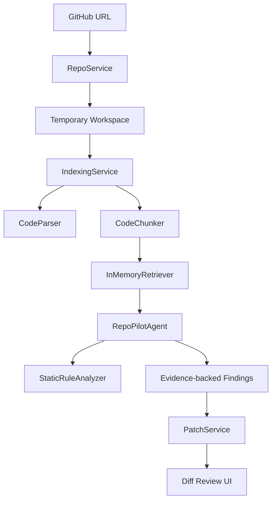

# RepoPilot

> 무료로 배포된 GitHub 저장소 분석 Agent

[English README](README.en.md)

Live Demo: [https://jeonghwanju-repopilot.hf.space](https://jeonghwanju-repopilot.hf.space/)

RepoPilot은 public GitHub 저장소를 가져와서 코드를 인덱싱하고, 파일/라인 근거가 있는 분석 결과와 patch 초안을 보여주는 무료 웹 데모입니다. OpenAI, Claude, 유료 DB, 유료 vector DB 없이 동작합니다.

프로젝트 구조와 코드를 자세히 이해하려면 웹으로 렌더링되는 [RepoPilot 코드 해설서](https://coding-jhj.github.io/RepoPilot/)를 보면 됩니다.


## 현재 되는 것

- public GitHub 저장소 URL 입력
- 저장소 clone 및 임시 workspace 생성
- Python, JavaScript, TypeScript, Markdown 파일 인덱싱
- Python AST 기반 class/function/import 추출
- JS/TS 간단 symbol/import 추출
- local retrieval 기반 관련 코드 chunk 검색
- agent timeline 표시
- 파일/라인 근거가 포함된 finding 표시
- 무료 정적 분석 rule 실행
  - hardcoded secret 후보
  - bare `except:`
  - `eval()` 사용
- 선택한 evidence path 기준 patch draft 생성
- patch가 승인된 파일 범위 안에 있는지 검증
- FastAPI가 Next.js static export를 함께 서빙
- Hugging Face Spaces CPU Basic 무료 배포

## 아직 안 되는 것

- 실제 LLM 기반 깊은 버그 추론
- 실제 GitHub Pull Request 생성
- patch를 원본 repo에 직접 적용
- 대형 repo 전체 분석
- tree-sitter 기반 정밀 parsing
- 영구 저장소 또는 사용자별 history 저장

이 프로젝트는 “완성형 Devin 클론”이 아니라, **돈 안 드는 무료 환경에서 실무형 Agent 구조를 어디까지 만들 수 있는지 보여주는 MVP**입니다.

## 사용 흐름

```txt
GitHub URL 입력
  -> repo clone
  -> 파일 인덱싱
  -> 코드 chunk 검색
  -> agent workflow 실행
  -> evidence 기반 finding 표시
  -> patch draft 생성
  -> scope validation
```

## 아키텍처



## Agent Workflow

```txt
Planner
  -> RepoReader
  -> CodeSearcher
  -> ArchitectureAnalyzer
  -> BugDetector
  -> TestWriter
  -> PatchWriter
  -> Reviewer
```

핵심 원칙:

> 파일 단위 문제를 말할 때는 반드시 retrieved code evidence를 함께 보여준다.

## 기술 스택

| 영역 | 기술 |
| --- | --- |
| Backend | FastAPI, Pydantic |
| Frontend | Next.js static export, React, TypeScript |
| Deployment | Hugging Face Spaces Docker |
| Code Analysis | Python AST, JS/TS regex scaffold |
| Retrieval | In-memory chunk search |
| Static Rules | hardcoded secret, bare except, eval 탐지 |
| LLM | 기본 사용 안 함 |
| Tests | pytest, Next.js build |

## 무료 배포 구조

```txt
Hugging Face Spaces CPU Basic
  -> Dockerfile
  -> Next.js static export
  -> FastAPI static file serving
  -> local static-analysis agent
```

무료로 유지하기 위해 다음을 사용하지 않습니다.

- OpenAI API
- Claude API
- paid inference API
- Qdrant Cloud
- hosted database
- GPU instance

Space 환경에서는 repo/file 크기와 clone timeout을 제한합니다.

```txt
REPOPILOT_MAX_FILES_INDEXED=120
REPOPILOT_MAX_FILE_BYTES=120000
REPOPILOT_CLONE_TIMEOUT_SECONDS=45
```

## 로컬 실행

Backend:

```bash
cd apps/api
python -m pip install -e .[dev]
uvicorn app.main:app --reload
```

Frontend:

```bash
cd apps/web
npm install
npm run dev
```

Docker:

```bash
docker build -t repopilot .
docker run --rm -p 7860:7860 repopilot
```

## 테스트

Backend:

```bash
cd apps/api
python -m pytest tests
```

Frontend:

```bash
cd apps/web
npm install
npm run build
```

현재 검증 상태:

- backend tests: `17 passed`
- Next.js static export build 통과
- Hugging Face Space `/health` 응답 확인
- Hugging Face Space 웹 페이지 HTTP `200` 확인

## 주요 파일

```txt
apps/api/app/main.py                     # FastAPI app + static frontend serving
apps/api/app/services/repo_service.py    # GitHub URL validation, clone, workspace path
apps/api/app/services/indexing_service.py# file walking, parsing, chunk indexing
apps/api/app/code/parser.py              # Python/JS/TS lightweight parser
apps/api/app/code/rules.py               # free static-analysis rules
apps/api/app/agents/graph.py             # agent node workflow runner
apps/api/app/services/patch_service.py   # patch draft + scope validation
apps/web/app/page.tsx                    # main demo UI
Dockerfile                               # Hugging Face Spaces deployment image
```

## 다음 개선 계획

- 정적 분석 rule set 확장
- tree-sitter 기반 parser 교체
- dependency graph 기반 위험 탐지
- patch template 품질 개선
- 작은 demo repo benchmark 추가
- 실제 GitHub PR 생성은 선택 기능으로 분리

## 한계

무료 배포 환경에서는 CPU, 디스크, 네트워크, 실행 시간 제한이 있습니다. 그래서 RepoPilot은 작은 public repo를 대상으로 한 데모에 최적화되어 있습니다. 현재 finding은 LLM 추론이 아니라 deterministic static rule 기반입니다.
