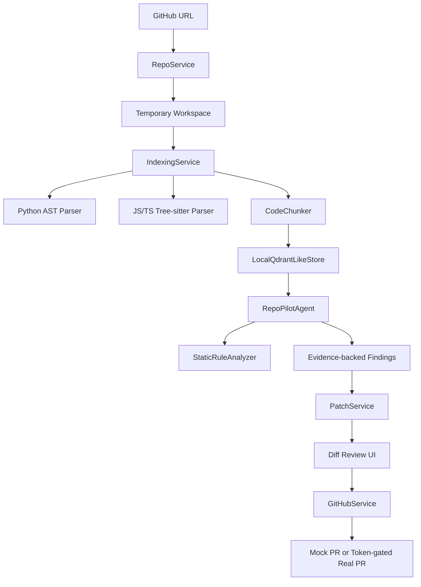

# RepoPilot

> public GitHub 저장소를 가져와 파일/라인 근거가 있는 분석 결과와 patch 초안을 만드는 free-first repo analysis agent입니다.

[English README](README.en.md) · Live Demo: [https://jeonghwanju-repopilot.hf.space](https://jeonghwanju-repopilot.hf.space/) · Code Guide: [https://coding-jhj.github.io/RepoPilot/](https://coding-jhj.github.io/RepoPilot/)

RepoPilot은 public GitHub 저장소를 clone하고, 소스 파일을 인덱싱하고, deterministic local analysis를 실행한 뒤 파일/라인 근거가 포함된 findings와 patch drafts를 보여주는 웹 데모입니다. OpenAI, Claude, 유료 inference API, hosted DB, 유료 vector DB 없이 repo-aware AI engineering workflow를 보여주는 포트폴리오형 MVP입니다.


## 만든 이유

많은 coding-agent 데모는 유료 LLM 호출과 opaque infrastructure 뒤에 핵심을 숨깁니다. RepoPilot은 repo workflow 자체를 보여주는 데 집중합니다.

1. public repository를 가져옵니다.
2. 제한된 환경에서 실제 파일을 인덱싱합니다.
3. 관련 코드 chunk를 검색합니다.
4. agent-like analysis step을 순차 실행합니다.
5. 파일/라인 근거가 없으면 문제를 주장하지 않습니다.
6. 승인된 path에 대해서만 patch draft를 만듭니다.
7. 사용자가 token과 confirmation을 제공한 경우에만 실제 GitHub PR을 생성합니다.

## 현재 되는 것

- public GitHub 저장소 URL 입력
- 저장소 clone 및 임시 workspace 생성
- clone timeout과 fallback demo workspace 처리
- Python, JavaScript, TypeScript, TSX, Markdown 파일 인덱싱
- Python AST 기반 class/function/import 추출
- JS/TS/TSX tree-sitter 기반 symbol/import 추출 및 regex fallback
- in-memory Qdrant-like boundary를 통한 local chunk retrieval
- agent workflow timeline 표시
- 파일/라인 근거가 포함된 finding 표시
- deterministic static-analysis rule 실행
  - hardcoded secret 후보
  - bare `except:`
  - `eval()` 사용
- 선택한 evidence path 기준 patch draft 생성
- 승인된 파일 범위 안에 patch가 있는지 검증
- token과 명시적 confirmation이 있을 때 실제 GitHub Pull Request 생성
- token이 없을 때 public demo용 mocked PR 응답 반환
- FastAPI가 Next.js static export를 함께 서빙
- Hugging Face Spaces CPU Basic 무료 배포

## 주장하지 않는 것

- Devin 클론이 아닙니다.
- 기본 동작에서 유료 LLM 기반 깊은 버그 추론을 하지 않습니다.
- 대형 repo 전체 분석에 최적화되어 있지 않습니다.
- 사용자별 history나 영구 workspace를 저장하지 않습니다.
- patch draft는 사람이 검토해야 합니다.

## 사용 흐름

```txt
GitHub URL 입력
  -> safe repo clone
  -> 제한 내 file walk
  -> parser + chunker
  -> local retrieval
  -> agent workflow
  -> evidence-backed findings
  -> scoped patch draft
  -> optional confirmed PR creation
```

## 아키텍처



## Agent Workflow

```txt
Planner
  -> RepoReader
  -> CodeSearcher
  -> ArchitectureAnalyzer
  -> BugDetector
  -> TestWriter
  -> PatchWriter
  -> Reviewer
```

핵심 품질 규칙:

> 파일 단위 문제를 말할 때는 반드시 retrieved file/line evidence를 함께 보여준다.

## 기술 스택

| 영역 | 기술 |
| --- | --- |
| Backend | FastAPI, Pydantic |
| Frontend | Next.js static export, React, TypeScript |
| Deployment | Hugging Face Spaces Docker |
| Code Analysis | Python AST, JS/TS/TSX tree-sitter, regex fallback |
| Retrieval | Qdrant-like boundary 뒤의 in-memory chunk search |
| Static Rules | hardcoded secret, bare except, eval 탐지 |
| GitHub | token-gated branch, commit, PR REST flow |
| LLM | 기본 사용 안 함 |
| Tests | pytest, Next.js build |

## 로컬 실행

Backend:

```bash
cd apps/api
python -m pip install -e .[dev]
uvicorn app.main:app --reload
```

Frontend:

```bash
cd apps/web
npm install
npm run dev
```

Docker:

```bash
docker build -t repopilot .
docker run --rm -p 7860:7860 repopilot
```

## 무료 배포 제한

Hugging Face Spaces CPU Basic 환경을 전제로 다음 제한을 둡니다.

```txt
REPOPILOT_MAX_FILES_INDEXED=120
REPOPILOT_MAX_FILE_BYTES=120000
REPOPILOT_CLONE_TIMEOUT_SECONDS=45
```

## 테스트

Backend:

```bash
cd apps/api
python -m pytest tests
```

Frontend:

```bash
cd apps/web
npm install
npm run build
```

검증 대상:

- backend test suite
- tree-sitter JS/TS parsing regression tests
- GitHub PR service mock-transport tests
- Next.js static export build
- Hugging Face Space `/health` response

## 주요 파일

```txt
apps/api/app/main.py                       FastAPI app + static frontend serving
apps/api/app/services/repo_service.py      GitHub URL validation, clone, workspace path
apps/api/app/services/indexing_service.py  file walking, parsing, chunk indexing
apps/api/app/code/parser.py                Python AST + JS/TS parser dispatch
apps/api/app/code/treesitter_parser.py     tree-sitter JS/TS/TSX symbols/imports
apps/api/app/code/rules.py                 deterministic static-analysis rules
apps/api/app/agents/graph.py               agent node workflow runner
apps/api/app/services/patch_service.py     patch draft + scope validation
apps/api/app/services/github_service.py    mock vs real PR entry point
apps/api/app/services/github_pr_service.py GitHub REST branch/commit/PR flow
apps/web/app/page.tsx                      main demo UI
Dockerfile                                 Hugging Face Spaces deployment image
```

## 다음 개선 계획

- [ ] deterministic rule coverage 확장
- [ ] dependency graph 기반 위험 탐지
- [ ] patch template 품질 개선
- [ ] 작은 demo repo benchmark 추가
- [ ] unified diff application flow 추가
- [ ] frontend PR token flow를 더 안전한 UX로 연결

## 한계

RepoPilot은 free infrastructure에서 작은 public repo를 분석하는 데 최적화되어 있습니다. CPU, 디스크, 네트워크, 실행 시간 제한이 있습니다. 기본 findings는 deterministic static-rule과 retrieval 결과이며, 향후 LLM provider를 명시적으로 활성화하지 않는 한 paid LLM reasoning을 사용하지 않습니다.
