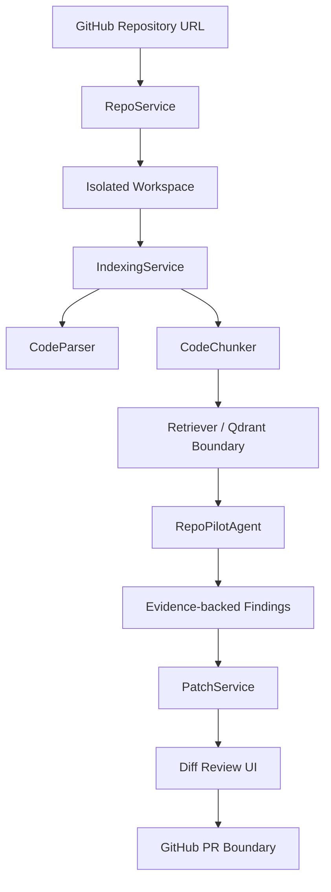

# RepoPilot

> GitHub 저장소를 분석하고, 근거 기반 코드 리뷰와 패치 초안을 생성하는 AI Software Engineer Agent

[English README](README.en.md)

RepoPilot은 개발자를 위한 AI 동료를 목표로 만든 포트폴리오용 AI Software Engineer Agent입니다. 모든 저장소를 완전히 자동 수정하는 Devin 클론을 목표로 하기보다, 실제 면접에서 설명 가능한 현실적인 흐름에 집중했습니다.

즉, 저장소를 가져오고, 코드를 인덱싱하고, 관련 근거를 검색한 뒤, agent workflow를 실행해서 파일/라인 기반 finding과 patch draft를 보여주는 구조입니다.


## 왜 만들었나

요즘 개발 조직은 단순히 LLM API를 호출하는 개발자보다, AI를 이용해 개발 생산성을 실제로 높일 수 있는 엔지니어를 더 중요하게 봅니다.

RepoPilot은 그 방향을 보여주기 위해 다음 요소를 담았습니다.

- GitHub 저장소 가져오기와 인덱싱
- 정적 코드 분석
- RAG 기반 코드 검색
- multi-step agent workflow
- 파일/라인 근거가 있는 분석 결과
- patch diff 생성과 scope 검증
- 비용을 고려한 cloud LLM 중심 설계
- API 비용 없이 개발 가능한 fake provider

## 현재 구현 수준

현재는 “동작하는 1차 MVP 수직 슬라이스” 수준입니다.

- FastAPI 백엔드
- Next.js 대시보드
- public GitHub repo import API
- repo indexing API
- Python, JavaScript, TypeScript, Markdown 파일 인덱싱
- Python AST 기반 symbol/import 추출
- JS/TS regex 기반 parsing scaffold
- in-memory retrieval layer
- LangGraph 스타일 agent node graph
- evidence 기반 finding
- patch draft 생성
- patch scope validation
- mock PR workflow
- 테스트와 문서

실제 고성능 분석을 위한 OpenAI/Claude 호출, Qdrant 저장, tree-sitter parsing은 다음 단계로 분리해두었습니다. 핵심 경계가 이미 나뉘어 있어서 이후 교체와 확장이 쉽도록 설계했습니다.

## 데모 흐름

```txt
GitHub 저장소 URL 입력
  -> 안전한 public repo import
  -> 코드 인덱싱
  -> symbol/import/file metadata 추출
  -> 파일/라인 근거 기반 retrieval
  -> agent timeline 실행
  -> grounded finding 생성
  -> scoped patch draft 생성
  -> PR workflow boundary
```

## Architecture



## Agent Workflow

```txt
Planner
  -> RepoReader
  -> CodeSearcher
  -> ArchitectureAnalyzer
  -> BugDetector
  -> TestWriter
  -> PatchWriter
  -> Reviewer
```

핵심 규칙:

> RepoPilot은 retrieved code evidence 없이 파일 단위 문제를 주장하지 않는다.

## 기술 스택

| 영역 | 기술 |
| --- | --- |
| Backend | FastAPI, Pydantic |
| Frontend | Next.js, React, TypeScript |
| Agent Boundary | LangGraph-style stateful node graph |
| Retrieval | In-memory MVP, Qdrant-ready boundary |
| Code Analysis | Python AST, JS/TS regex scaffold, tree-sitter 예정 |
| LLM | 현재 fake provider, 이후 OpenAI/Claude adapter |
| DevOps | Docker Compose |
| Testing | pytest, Next.js build validation |

## 비용 전략

RepoPilot은 고품질 코드 분석을 위해 cloud LLM을 primary path로 보는 설계입니다. 다만 비용이 폭주하지 않도록 다음 구조를 둡니다.

- local/test용 fake provider
- LLM 호출 전 retrieval 선행
- 기본은 shallow analysis
- deep analysis는 명시적 toggle
- indexing file count limit
- file size limit
- patch 생성은 별도 action
- PR 생성은 confirmation 필요

Ollama 같은 local model은 fallback으로 둘 수 있지만, 코드 분석과 patch 품질을 보여주는 메인 경로로는 OpenAI/Claude 계열 모델을 사용하는 것을 전제로 합니다.

## 실행 방법

Backend:

```bash
cd apps/api
python -m pip install -e .[dev]
uvicorn app.main:app --reload
```

Frontend:

```bash
cd apps/web
npm install
npm run dev
```

브라우저에서 접속:

```txt
http://localhost:3000
```

Docker:

```bash
docker compose up
```

## 테스트

Backend tests:

```bash
cd apps/api
python -m pytest tests
```

Frontend build:

```bash
cd apps/web
npm install
npm run build
```

현재 MVP 검증 결과:

- backend tests: `12 passed`
- Python compile check 통과
- Next.js production build 통과
- API health endpoint: `ok`
- web dev server: HTTP `200`

## 환경 변수

기본 무료 개발 모드:

```txt
REPOPILOT_LLM_PROVIDER=fake
```

향후 고품질 분석 모드:

```txt
REPOPILOT_LLM_PROVIDER=openai
REPOPILOT_OPENAI_API_KEY=...
```

또는:

```txt
REPOPILOT_LLM_PROVIDER=anthropic
REPOPILOT_ANTHROPIC_API_KEY=...
```

## Roadmap

- [ ] fake provider를 실제 OpenAI/Claude adapter로 교체
- [ ] Qdrant 기반 vector retrieval 추가
- [ ] JS/TS regex parsing을 tree-sitter로 교체
- [ ] commit SHA / file hash 기반 cache 추가
- [ ] bug scan prompt를 structured output으로 개선
- [ ] 선택한 finding에 대한 test generation 구현
- [ ] isolated branch에서 patch apply
- [ ] 실제 GitHub Pull Request 생성
- [ ] demo GIF와 benchmark case 추가

## 한계

RepoPilot은 의도적으로 scope를 제한한 프로젝트입니다. 현재 목표는 “큰 production system을 완전 자동으로 고치는 Agent”가 아니라, 코드베이스 이해, 근거 기반 리뷰, 테스트 제안, 작은 patch draft 생성에 최적화된 AI Software Engineer Agent입니다.

자세한 한계와 실패 케이스는 [docs/failure-cases.md](docs/failure-cases.md)에 정리했습니다.
